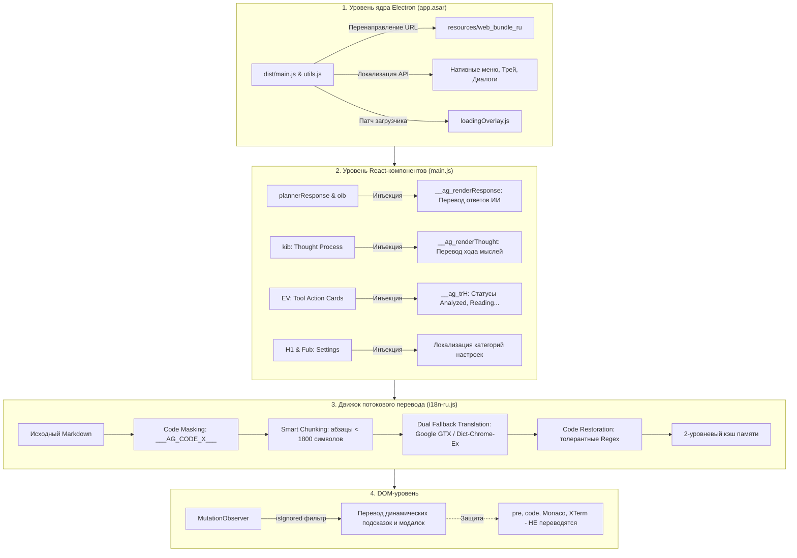

# Google Antigravity Localizer (Русификатор)

[](LICENSE)
[](https://github.com/j46871417-ui/Antigravity-Localizer/releases)
[](https://t.me/+8qU7020rMF84OWNi)

Полноценная русская локализация для экосистемы **Google Antigravity**:
- **Antigravity 2.0 Desktop** — перевод 2 200+ элементов интерфейса, нативного меню окна, трея, диалогов, экрана предзагрузки, виртуальных списков, диффов, селектора моделей и всех настроек.
- **Живой перевод мыслей и ответов ИИ на лету** — автоматический перевод блоков размышлений (Thought Process) и основных ответов ассистента с сохранением синтаксиса кода.
- **Antigravity IDE (VS Code Edition)** — локализация каркаса редактора (15 000+ строк интерфейса) и команд управления агентами.

---

## ⚡ Быстрая установка

### Способ 1: Готовый инсталлятор (Рекомендуется)
1. Скачай актуальный файл **`AntigravityLocalizer_vX.X.X.exe`** из раздела [**Releases**](https://github.com/j46871417-ui/Antigravity-Localizer/releases).
2. Запусти установщик и нажми «Далее». Инсталлятор автоматически проверит запущенные процессы Antigravity, закроет их без конфликта занятых файлов, распакует компоненты и откроет панель русификатора.

### Способ 2: Установка через PowerShell (1 команда)
Открой **PowerShell** и выполни:
```powershell
irm https://raw.githubusercontent.com/j46871417-ui/Antigravity-Localizer/main/install.ps1 | iex
```

> **Для отката к оригинальной английской версии** запусти:
> ```powershell
> irm https://raw.githubusercontent.com/j46871417-ui/Antigravity-Localizer/main/install.ps1 | iex -Uninstall
> ```

---

## 🧠 Архитектура и принципы работы

Русификатор построен по принципу **многоуровневого гибридного перехвата** (Multi-Layer Injection). Вместо поверхностной замены текста в браузере модификация выполняется на уровне Electron-ядра, виртуального DOM React и сетевого рантайма.



---

### Принцип 1: Перенаправление бандла на уровне ядра Electron

Google Antigravity упакован в архив `resources/app.asar`. Внутри него находится точка входа Electron (`dist/main.js`, `dist/utils.js`).

1. **Безопасная точка входа**: скрипт инсталлятора патчит `dist/utils.js`, где формируется путь загрузки статических файлов.
2. **Изолированный каталог `web_bundle_ru`**: локализованный бандл размещается в отдельной директории `resources/web_bundle_ru/`, не разрушая оригинальные ресурсы приложения.
3. **Блокировка затирания**: патч механизма `updater.js` предотвращает фоновый тихий откат локализации при проверке версий.
4. **Нативные меню и трей**: перехватываются системные вызовы `Menu.setApplicationMenu` и `Tray`, обеспечивая перевод меню окна, контекстного меню и диалогов подтверждения выхода.

---

### Принцип 2: Инъекция компонентов в виртуальный DOM React

В Antigravity 2.0 интерфейс собран в монолитный бандл с React. Стандартный поиск и замена строк в DOM приводили бы к мерцанию, рассинхронизации состояния React Fiber и падению виртуального дерева.

Локализатор инжектирует собственные легковесные обёртки непосредственно в фабрику React-элементов (`y.createElement`):

- **Перевод ответов ИИ (`window.__ag_renderResponse`)**:
  - Точки перехвата: компонент рендеринга активного ответа `plannerResponse` и компонент истории `oib`.
  - Защита интерфейса: если модель уже генерирует текст на русском языке, управляющие кнопки скрываются и трафик не расходуется.
  - Тулбар управления: при ответе на английском появляется компактная панель `[⚡ Авто: ВКЛ/ВЫКЛ]` и `[🌐 RU / EN]`.
  - Сохранение дополнительных элементов: кнопки копирования, цитирования и метаданные шага передаются через `extraChild` без повреждения разметки.
- **Перевод размышлений (`window.__ag_renderThought`)**:
  - Точка перехвата: компонент `kib`.
  - Потоковый debounce: во время генерации мыслей перевод выполняется с задержкой 300 мс, создавая эффект синхронного русского потока без перегрузки API.
- **Карточки действий инструментов (`EV`)**:
  - Точка перехвата: единая функция рендеринга префиксов и заголовков шагов `EV({prefix, content, progressMessage, customTitle})`.
  - Функция `window.__ag_trH` мгновенно подменяет английские глаголы на русские эквиваленты:
    - `Analyzed` → **«Проанализировано»**, `Analyzing` → **«Анализ...»**
    - `Read` → **«Прочитано»**, `Reading` → **«Чтение...»**
    - `Edited` → **«Отредактировано»**, `Editing` → **«Редактирование...»**
    - `Executed` → **«Выполнено»**, `Executing` → **«Выполнение...»**
    - `Searched` → **«Найдено»**, `Searching` → **«Поиск...»**
    - `Built` → **«Собрано»**, `Building` → **«Сборка...»**
    - Действия браузера: переход по URL, клики по элементам, снятие скриншотов, чтение DOM.
- **Навигация настроек (`H1` и `Fub`)**:
  - Боковые вкладки (`General`, `Appearance`, `Models`, `Customizations`, `Shortcuts`, `Browser`, `Notifications`, `Editor` и др.) и заголовки групп переводятся напрямую в React-компонентах дерева.
- **Селектор моделей**:
  - Перевод уровней рассуждения модели: `low` → **«Экономный»**, `medium` → **«Средний»**, `high` → **«Высокая точность»**.

---

### Принцип 3: Сохранение целостности кода при нейропереводе

Главная проблема автоматического перевода в средах разработки — поломка блоков кода, Markdown-таблиц, названий переменных и путей к файлам.

Движок `translateLiveText` использует четырёхэтапный конвейер изоляции:

1. **Маскирование блоков кода (Code Masking)**:
   Все блоки кода ```lang ... ``` извлекаются и заменяются уникальными маркерами вида `___AG_CODE_0___`.
2. **Маскирование инлайн-кода (Inline Masking)**:
   Фрагменты внутри одиночных кавычек \`code\` маскируются маркерами `___AG_INL_0___`.
3. **Сегментация и двойной фолбэк (Dual-Endpoint Fallback)**:
   - Если объём текста превышает 1 800 символов, текст разбивается на абзацы по границам `\n\n`.
   - Запрос отправляется на primary endpoint Google Translate (GTX).
   - При сбое сети или тайм-ауте происходит автоматическое переключение на вторичный endpoint (`dict-chrome-ex`).
4. **Толерантное восстановление (Tolerant Restoration)**:
   Переводчики могут добавлять пробелы вокруг символов подчеркивания (`___ AG_CODE_0 ___`) или менять регистр. Восстановление выполняется гибкими регулярными выражениями:
   ```javascript
   new RegExp(`___\\s*AG_CODE_${i}\\s*___`, 'gi')
   ```
   Исходный код, отступы и символы возвращаются в исходный вид со 100% точностью.
5. **Двухуровневое кэширование**:
   Результаты сохраняются в `Map`-кэше рантайма. Повторное переключение между оригиналом и переводом происходит за 0 мс без сетевых запросов.

---

### Принцип 4: Защита чувствительных зон DOM (isIgnored)

Для перевода всплывающих подсказок, контекстных меню и модальных окон используется фоновый `MutationObserver`. Чтобы исключить вмешательство в рабочий процесс разработчика, задействован строгий фильтр зон исключения:

```javascript
function isIgnored(node) {
  // Полный запрет перевода внутри исходного кода и терминала
  if (node.closest('pre, code, .monaco-editor, .xterm, .prism-code, [data-testid="code-block"]')) {
    return true;
  }
  // Запрет редактирования полей ввода и токенов подсветки
  if (node.closest('input, textarea, [contenteditable="true"], .token')) {
    return true;
  }
  return false;
}
```

Благодаря этому терминал, файлы проекта, диффы и подсветка синтаксиса остаются в неприкосновенности.

---

### Принцип 5: Безопасный двухэтапный инсталлятор

1. **Предотвращение файловых конфликтов (File Lock Guard)**:
   Перед началом распаковки инсталлятор опрашивает запущенные процессы `Antigravity.exe` и `language_server.exe`. Пользователь получает предупреждение, и процессы завершаются без повреждения данных.
2. **Чистая последовательность окон**:
   Окно Inno Setup закрывается сразу после распаковки файлов, и только после этого отображается панель управления русификатора. На экране не остаётся зависших окон мастера.
3. **Автономность (Zero Dependencies)**:
   Все файлы русификации, C# утилита и веб-бандл упакованы в единый сжатый архив (LZMA2), не требующий подключения к интернету во время установки.

---

## 🌟 Сравнение возможностей

| Возможность | Базовые русификаторы | **Google Antigravity Localizer** |
|---|:---:|:---:|
| **Количество переведённых фраз** | ~700 | **2 200+ уникальных фраз** |
| **Живой перевод мыслей ИИ (Thought Process)** | ❌ Нет | **✅ Автоматически на лету с debounce** |
| **Живой перевод ответов ИИ в чате** | ❌ Нет | **✅ Встроенный тулбар [Авто] и [RU/EN]** |
| **Сохранение синтаксиса и отступов кода** | ❌ Ломает код | **✅ 100% защита блоков кода и инлайна** |
| **Карточки действий инструментов (`Analyzed`, `Read`)** | ❌ На английском | **✅ Полная русификация всех 37 типов действий** |
| **Селектор моделей** | `Medium` | **✅ «Экономный», «Средний», «Высокая точность»** |
| **Все разделы настроек (Settings)** | Частично | **✅ Все вкладки и параметры** |
| **Antigravity IDE (VS Code)** | ❌ Нет | **✅ 15 000+ строк интерфейса ядра** |
| **Защита от автообновлений** | ❌ Сбрасывается | **✅ Патч `updater.js` блокирует затирание** |
| **Резервное копирование и откат** | Ручной | **✅ Автобэкап и откат в 1 клик** |

---

## 📁 Структура проекта

```
├── Program.cs                  # Исходный код C# утилиты локализации и графического интерфейса
├── setup.iss                   # Скрипт сборщика инсталлятора Inno Setup с проверкой процессов
├── publish_new_release.py      # Автоматизация сборки, версионирования, GitHub Release и Telegram
├── install.ps1                 # Сценарий установки через PowerShell
├── install.bat                 # Пакетный лаунчер для Windows
├── resources/
│   ├── app.asar                # Модифицированное ядро Electron с точками перехвата
│   └── web_bundle_ru/
│       ├── main.js             # Пропатченный React-бандл (компоненты ответа, мыслей, действий)
│       ├── i18n-ru.js          # Движок словаря (2200+ фраз), translateLiveText и обёртки
│       ├── index.html          # Шаблон интерфейса
│       └── *.css               # Стили интерфейса
└── translations/
    ├── dom_translator.js       # Резервный DOM-транслятор
    └── ide_strings.json        # Таблица перевода для расширения IDE
```

---

## 💬 Сообщество и поддержка

Обсуждение русификатора, предложений и новых версий:  
👉 **[Вступить в Telegram-группу](https://t.me/+8qU7020rMF84OWNi)**

---

## 📄 Лицензия

Распространяется под свободной лицензией [MIT](LICENSE).
