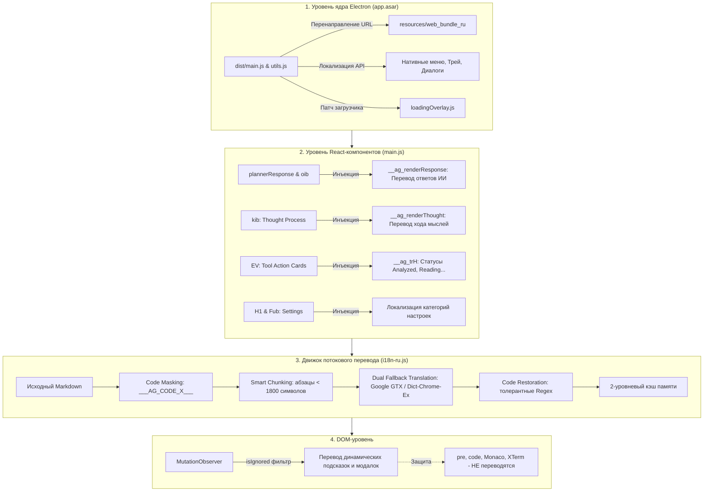

# Google Antigravity Localizer (Русификатор)

[](LICENSE)
[](https://github.com/j46871417-ui/Antigravity-Localizer/releases)
[](https://t.me/+8qU7020rMF84OWNi)

Полноценная русская локализация для экосистемы **Google Antigravity**:
- **Antigravity 2.0 Desktop** — перевод 2 200+ элементов интерфейса, нативного меню окна, трея, диалогов, экрана предзагрузки, виртуальных списков, диффов, селектора моделей и всех настроек.
- **Живой перевод мыслей и ответов ИИ на лету** — автоматический перевод блоков размышлений (Thought Process) и основных ответов ассистента с сохранением синтаксиса кода.
- **Antigravity IDE (VS Code Edition)** — локализация каркаса редактора (15 000+ строк интерфейса) и команд управления агентами.

---

## ⚡ Быстрая установка

### Способ 1: Готовый файл из релиза (Рекомендуется)
1. Скачай актуальный файл **`AntigravityLocalizer.exe`** из раздела [**Releases**](https://github.com/j46871417-ui/Antigravity-Localizer/releases).
2. Запусти его и нажми «Далее». Программа автоматически проверит запущенные процессы Antigravity, закроет их без конфликта занятых файлов, распакует компоненты и откроет панель русификатора.

### Способ 2: Установка через PowerShell (1 команда)
Открой **PowerShell** и выполни:
```powershell
irm https://raw.githubusercontent.com/j46871417-ui/Antigravity-Localizer/main/install.ps1 | iex
```

> **Для отката к оригинальной английской версии** запусти:
> ```powershell
> irm https://raw.githubusercontent.com/j46871417-ui/Antigravity-Localizer/main/install.ps1 | iex
> ```
> Затем в открывшемся окне выбери пункт отката, либо запусти скрипт с параметром `-Uninstall`:
> ```powershell
> & ([scriptblock]::Create((irm https://raw.githubusercontent.com/j46871417-ui/Antigravity-Localizer/main/install.ps1))) -Uninstall
> ```
>
> Предыдущий вариант записи (`... | iex -Uninstall`) не работает: `-Uninstall`
> попадает в сам `iex`, а не в скрипт.

---

## ⚠️ Правовая оговорка

Репозиторий и скрипты локализации распространяются под свободной лицензией MIT.

Официальный установщик (**`AntigravityLocalizer.exe`** на базе Python):
- Работает локально на компьютере пользователя;
- Проверяет версию установленного Antigravity перед началом работы по манифесту совместимости (поддерживается ядро 2.11.0);
- Выполняет локальное in-place патчирование точек подключения языкового бандла в установленном `app.asar` и размещает файлы перевода в `resources/web_bundle_ru/`;
- Создаёт автоматическую резервную копию оригинала перед внесением любых изменений.

Сценарий **`install.ps1`**:
- Загружает проверенные файлы локализации и подготовленное ядро из официального репозитория;
- Выполняет строгую проверку контрольной суммы SHA256 загружаемого архива (при указании `-ExpectedHash`);
- Проверяет совместимость установленной версии Antigravity (2.11.0) и отменяет установку без изменений при несовместимости;
- Создаёт резервную копию оригинального `app.asar` перед копированием.

---

## 📦 Как выпускается релиз (для сопровождающих)

**Единственный поддерживаемый путь — CI по тегу.** Локальный запуск
`publish_new_release.py` не является штатным способом выпуска.

```powershell
git tag v0.9.8
git push origin v0.9.8
```

Тег вида `v*` запускает workflow `.github/workflows/build.yml`:

1. **job `test`** — прогоняет 61 тест на стандартной библиотеке. Если тест
   падает, дальше ничего не собирается;
2. **job `build`** (`needs: test`) — собирает `AntigravityLocalizer.exe`
   через PyInstaller и создаёт GitHub Release с этим файлом (шаг
   срабатывает только на тегах: `if: startsWith(github.ref, 'refs/tags/')`).

### Почему не publish_new_release.py

В репозитории исторически два независимых релизных конвейера, и оба
публиковали файл **с одним и тем же именем `AntigravityLocalizer.exe`**,
но с разным содержимым:

| Конвейер | Сборка | Что кладёт под этим именем |
|---|---|---|
| CI (workflow) | PyInstaller | Python-версия |
| `publish_new_release.py` | `csc.exe` | C#-версия |

Разные программы под одним именем означают, что в релизе окажется тот
файл, чей конвейер отработал последним. Пользователь при этом видит одну
ссылку и не может отличить сборки.

Поэтому штатным объявлен только CI. У `publish_new_release.py` при этом:

- аргумент с тегом **обязателен** — запуск без него завершается отказом
  (код возврата 2) до любых правок файлов, а не подставляет старый тег;
- все артефакты проверяются на существование **до** создания релиза, иначе
  отказ (код возврата 3): прежде релиз публиковался пустым, без вложений;
- для сборки инсталлятора нужен Inno Setup 6 (или переменная `ISCC_PATH`).
  Без него инсталлятор не собирается, и релиз создаётся без него.

Если всё же запускаешь скрипт вручную, убедись, что CI для этого тега не
запускался, иначе вложения релиза перезапишутся.

---

## 🧠 Архитектура и принципы работы

Русификатор построен по принципу **многоуровневого гибридного перехвата** (Multi-Layer Injection). Вместо поверхностной замены текста в браузере модификация выполняется на уровне Electron-ядра, виртуального DOM React и сетевого рантайма.


```mermaid
flowchart TD
    subgraph Core ["1. Уровень ядра Electron (app.asar)"]
        A["dist/main.js & utils.js"] -->|Перенаправление URL| B["resources/web_bundle_ru"]
        A -->|Локализация API| C["Нативные меню, Трей, Диалоги"]
        A -->|Патч загрузчика| D["loadingOverlay.js"]
    end

    subgraph ReactLayer ["2. Уровень React-компонентов (main.js)"]
        E["plannerResponse & oib"] -->|Инъекция| F["__ag_renderResponse: Перевод ответов ИИ"]
        G["kib: Thought Process"] -->|Инъекция| H["__ag_renderThought: Перевод хода мыслей"]
        I["EV: Tool Action Cards"] -->|Инъекция| J["__ag_trH: Статусы Analyzed, Reading..."]
        K["H1 & Fub: Settings"] -->|Инъекция| L["Локализация категорий настроек"]
    end

    subgraph Engine ["3. Движок потокового перевода (i18n-ru.js)"]
        M["Исходный Markdown"] --> N["Code Masking: ___AG_CODE_X___"]
        N --> O["Smart Chunking: абзацы < 1800 символов"]
        O --> P["Dual Fallback Translation: Google GTX / Dict-Chrome-Ex"]
        P --> Q["Code Restoration: толерантные Regex"]
        Q --> R["2-уровневый кэш памяти"]
    end

    subgraph DOM ["4. DOM-уровень"]
        S["MutationObserver"] -->|isIgnored фильтр| T["Перевод динамических подсказок и модалок"]
        T -.->|Защита| U["pre, code, Monaco, XTerm - НЕ переводятся"]
    end

    Core --> ReactLayer
    ReactLayer --> Engine
    Engine --> DOM
```

---

### Принцип 1: Перенаправление бандла на уровне ядра Electron

Google Antigravity упакован в архив `resources/app.asar`. Внутри него находится точка входа Electron (`dist/main.js`, `dist/utils.js`).

1. **Безопасная точка входа**: скрипт инсталлятора патчит `dist/utils.js`, где формируется путь загрузки статических файлов.
2. **Изолированный каталог `web_bundle_ru`**: локализованный бандл размещается в отдельной директории `resources/web_bundle_ru/`, не разрушая оригинальные ресурсы приложения.
3. **Блокировка затирания**: патч механизма `updater.js` предотвращает фоновый тихий откат локализации при проверке версий.
4. **Нативные меню и трей**: перехватываются системные вызовы `Menu.setApplicationMenu` и `Tray`, обеспечивая перевод меню окна, контекстного меню и диалогов подтверждения выхода.

---

### Принцип 2: Инъекция компонентов в виртуальный DOM React

В Antigravity 2.0 интерфейс собран в монолитный бандл с React. Стандартный поиск и замена строк в DOM приводили бы к мерцанию, рассинхронизации состояния React Fiber и падению виртуального дерева.

Локализатор инжектирует собственные легковесные обёртки непосредственно в фабрику React-элементов (`y.createElement`):

- **Перевод ответов ИИ (`window.__ag_renderResponse`)**:
  - Точки перехвата: компонент рендеринга активного ответа `plannerResponse` и компонент истории `oib`.
  - Защита интерфейса: если модель уже генерирует текст на русском языке, управляющие кнопки скрываются и трафик не расходуется.
  - Тулбар управления: при ответе на английском появляется компактная панель `[⚡ Авто: ВКЛ/ВЫКЛ]` и `[🌐 RU / EN]`.
  - Сохранение дополнительных элементов: кнопки копирования, цитирования и метаданные шага передаются через `extraChild` без повреждения разметки.
- **Перевод размышлений (`window.__ag_renderThought`)**:
  - Точка перехвата: компонент `kib`.
  - Потоковый debounce: во время генерации мыслей перевод выполняется с задержкой 300 мс, создавая эффект синхронного русского потока без перегрузки API.
- **Карточки действий инструментов (`EV`)**:
  - Точка перехвата: единая функция рендеринга префиксов и заголовков шагов `EV({prefix, content, progressMessage, customTitle})`.
  - Функция `window.__ag_trH` мгновенно подменяет английские глаголы на русские эквиваленты:
    - `Analyzed` → **«Проанализировано»**, `Analyzing` → **«Анализ...»**
    - `Read` → **«Прочитано»**, `Reading` → **«Чтение...»**
    - `Edited` → **«Отредактировано»**, `Editing` → **«Редактирование...»**
    - `Executed` → **«Выполнено»**, `Executing` → **«Выполнение...»**
    - `Searched` → **«Найдено»**, `Searching` → **«Поиск...»**
    - `Built` → **«Собрано»**, `Building` → **«Сборка...»**
    - Действия браузера: переход по URL, клики по элементам, снятие скриншотов, чтение DOM.
- **Навигация настроек (`H1` и `Fub`)**:
  - Боковые вкладки (`General`, `Appearance`, `Models`, `Customizations`, `Shortcuts`, `Browser`, `Notifications`, `Editor` и др.) и заголовки групп переводятся напрямую в React-компонентах дерева.
- **Селектор моделей**:
  - Перевод уровней рассуждения модели: `low` → **«Экономный»**, `medium` → **«Средний»**, `high` → **«Высокая точность»**.

---

### Принцип 3: Сохранение целостности кода и сетевая безопасность при переводе

Автоматический перевод в средах разработки требует аккуратной изоляции чувствительных конструкций кода, Markdown-таблиц и URL.

Движок локализации использует архитектуру безопасной обработки:

1. **Криптостойкое экранирование (`MarkdownShield`)**:
   - Блоки кода (включая стриминговые блоки), инлайн-код любой длины и URL в Markdown-ссылках маскируются токенами с уникальным для каждого экземпляра сессионным нонсом: `⟦AGB_${nonce}_${id}⟧`.
   - Исходный код, отступы, пробелы и множественные переносы строк сохраняются побайтово без нормализации или обрезки.
   - Реализована верификация целостности: если маркер повреждается внешней службой перевода, оригинальный код гарантированно возвращается в текст.

2. **Очередь запросов и безопасное разбиение**:
   - `splitTextIntoSafeChunks(text, 1000)` разбивает длинный текст по абзацам и предложениям, контролируя границы UTF-16 суррогатных пар и защитных токенов.
   - `GlobalRequestQueue` обеспечивает строгий лимит конкурентности (не более 2 параллельных запросов), защищая от лимитов провайдеров.
   - Запросы используют `AbortSignal` для своевременной отмены при переключении сообщений или перерисовке интерфейса.

3. **Приватность и управление сетью (Privacy & Governance)**:
   - Сетевой автоперевод по умолчанию **строго выключен** (opt-in). Без явной команды пользователя сетевые запросы не инициируются.
   - Исключены несанкционированные сторонние сервисы перевода (MyMemory).
   - Двухуровневый кэш по умолчанию функционирует исключительно in-memory (L1), предотвращая нежелательную запись пользовательских данных на диск.
   - Логирование санитизировано: текст чата и фрагменты кода не передаются в лог консоли.

---

### Принцип 4: Защита чувствительных зон DOM (isIgnored)

Для перевода всплывающих подсказок, контекстных меню и модальных окон используется фоновый `MutationObserver`. Чтобы исключить вмешательство в рабочий процесс разработчика, задействован строгий фильтр зон исключения:

```javascript
function isIgnored(node) {
  // Полный запрет перевода внутри исходного кода и терминала
  if (node.closest('pre, code, .monaco-editor, .xterm, .prism-code, [data-testid="code-block"]')) {
    return true;
  }
  // Запрет редактирования полей ввода и токенов подсветки
  if (node.closest('input, textarea, [contenteditable="true"], .token')) {
    return true;
  }
  return false;
}
```

Благодаря этому терминал, файлы проекта, диффы и подсветка синтаксиса остаются в неприкосновенности.

---

### Принцип 5: Безопасный двухэтапный инсталлятор

1. **Транзакционность и защита от сбоев**:
   Установщик использует версионированные резервные копии с проверкой контрольных сумм SHA256 и журнал транзакций. При возникновении любой ошибки выполняется автоматический откат к исходному состоянию.
2. **Манифест совместимости**:
   Перед изменением файлов выполняется проверка поддерживаемых версий ядра Antigravity (2.11.0). Установка на несовместимые или непроверенные версии блокируется без модификации файлов.
3. **Автономность**:
   Официальный установщик на базе Python использует стандартную библиотеку и не требует внешних зависимостей во время установки.

---

## 🌟 Возможности локализации

| Возможность | Описание |
|---|---|
| **Интерфейс Antigravity Desktop** | Перевод 2 200+ элементов интерфейса, нативных оконных меню и настроек |
| **Перевод мыслей ИИ (Thought Process)** | Поддержка стриминга с debounce и управлением языком |
| **Перевод ответов ассистента в чате** | Встроенный тулбар с переключением [RU/EN] и настраиваемым автопереводом |
| **Защита исходного кода (`MarkdownShield`)** | Побайтовое сохранение блоков кода, инлайна и ссылок |
| **Безопасность и приватность** | Сетевой автоперевод выключен по умолчанию (opt-in), in-memory кэш |
| **Карточки действий инструментов** | Русификация глаголов и статусов действий агентов |
| **Селектор моделей** | Локализация режимов рассуждения |
| **Antigravity IDE (VS Code Edition)** | Локализация каркаса редактора и команд управления |
| **Резервное копирование и откат** | Версионированные бэкапы, транзакционный откат в 1 клик |

---

## 📁 Структура проекта

```
├── Program.cs                  # Исходный код C# утилиты локализации и графического интерфейса
├── setup.iss                   # Скрипт сборщика инсталлятора Inno Setup с проверкой процессов
├── publish_new_release.py      # Автоматизация сборки, версионирования, GitHub Release и Telegram
├── install.ps1                 # Сценарий установки через PowerShell
├── install.bat                 # Пакетный лаунчер для Windows
├── resources/
│   ├── app.asar                # Модифицированное ядро Electron с точками перехвата
│   └── web_bundle_ru/
│       ├── main.js             # Пропатченный React-бандл (компоненты ответа, мыслей, действий)
│       ├── i18n-ru.js          # Движок словаря (2200+ фраз), translateLiveText и обёртки
│       ├── index.html          # Шаблон интерфейса
│       └── *.css               # Стили интерфейса
└── translations/
    ├── dom_translator.js       # Резервный DOM-транслятор
    └── ide_strings.json        # Таблица перевода для расширения IDE
```

---

## 💬 Сообщество и поддержка

Обсуждение русификатора, предложений и новых версий:  
👉 **[Вступить в Telegram-группу](https://t.me/+8qU7020rMF84OWNi)**

---

## 📄 Лицензия

Распространяется под свободной лицензией [MIT](LICENSE).
